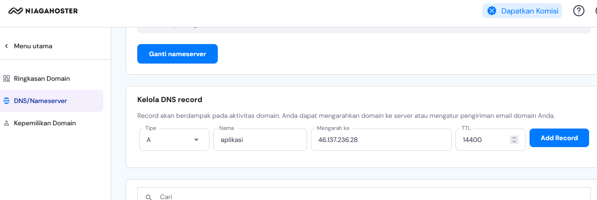
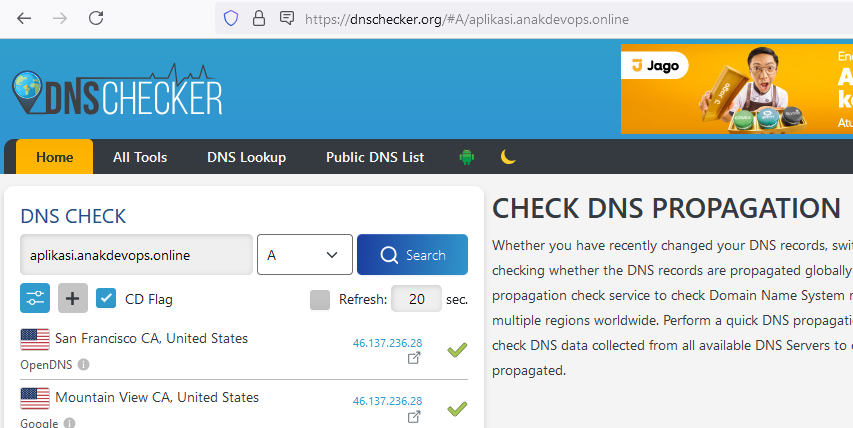

# Init , Plan , Apply

```
./init_terraform.sh
./plan_terraform.sh
./apply_terraform.sh
./output_terraform.sh
```

# Masukan ip public ke dns manager domain

```
46.137.236.28 aplikasi.anakdevops.online
```


periksa apakah domain sudah sesuai


# IP ec2 cicd

```
ec2_private_ips = [
  "172.31.38.235",
]
ec2_public_ips = [
  "46.137.236.28",
]
ssh -i security_groups/keypair_anakdevops.pem ubuntu@46.137.236.28
sudo su
docker ps -a #pastikan container sudah berjalan dan status gitlab healthy
edit pada /mnt/s3-bucket/aplikasi.anakdevops.online.conf
nano /mnt/s3-bucket/aplikasi.anakdevops.online.conf
    upstream aplikasi_backend {
    server 172.31.46.181:8081;
  } 
docker restart nginx-proxy #restart container nginx
```


# IP ec2 rancher

```
ec2_private_ips = [
  "172.31.20.215",
  "172.31.45.125",
]
ec2_public_ips = [
  "18.138.248.185",
  "47.128.255.251",
]
```


# Single Node | RKE v 1.6.1 | Kubernetes v1.27.16 | rancher v2.8.5

```
Node 1
ssh -i security_groups/keypair_anakdevops.pem ubuntu@18.138.248.185
sudo su
rke config -l
rke -v
rke config --list-version --all
ll /home/serverdevops/cluster.yml #pastikan file sudah ada
su serverdevops
cat /home/serverdevops/.ssh/id_rsa.pub
echo "ssh-rsa AAAAB3NzaC1yc2EAAAADAQABAAABAQDCTf6T6DPcXF44S9JRHUBqANFqBmlGXMJ5GNjW5dN9fxvR3tNUkYisp1J7bTOny10EAKs2GPog8fCiI1JRJnn4wuWhFfTsBWWPOG+7p6bEM2JPq+G2qVCJirLxcft0e5lud7+P6+D3T7i8B4xxDNpqjcuYshfZYKQGd3qoU5EmLStCgKSq1QwWrXjeTsbNYMTE79OVObxHW+++3XUla9ClEy2QfimT8fhzdvQqV516fXE4zR7l2Zt8fKGlV0xIlRnH5E9YJGaWcjWwWU2mgDqetuRUDXhPTiNgkyO6biyRCul6wIAhMTcHstZgUUWAT0HtYuEoaoQP6LnLVytuZtRb ansible-generated on ip-172-31-20-215" >> ~/.ssh/authorized_keys
ssh serverdevops@172.31.20.215
exit
docker --version
docker compose version
helm version
cd /home/serverdevops/
nano cluster.yml #sesuaikan IP
rke up --config cluster.yml
tunggu sampai Finished building Kubernetes cluster successfully
export KUBECONFIG=$HOME/kube_config_cluster.yml
kubectl get nodes
```

# Dashboard Rancher

```
cd /mnt/s3-bucket
sudo chmod +x dashboard_rancher.sh
sudo chown serverdevops:serverdevops dashboard_rancher.sh
./dashboard_rancher.sh
kubectl -n cattle-system get deploy rancher -w #Pastikan semua pod sudah berjalan
akses https://rnchr.anakdevops.online
```

# ARGOCD


```
helm repo add argo https://argoproj.github.io/argo-helm
helm repo update
helm install argocd argo/argo-cd --namespace argocd --create-namespace --set server.service.type=NodePort
akses argocd.anakdevops.online
kubectl -n argocd get secret argocd-initial-admin-secret -o jsonpath="{.data.password}" | base64 -d
```

# Add Node | RKE v 1.6.1 | Upgrade Kubernetes v1.27.16 to v1.28.12 (v1.28.12-rancher1-1) | rancher v2.8.5


```
Node 2
ssh -i security_groups/keypair_anakdevops.pem ubuntu@47.128.255.251
sudo su
su serverdevops
cat /home/serverdevops/.ssh/id_rsa.pub
echo "ssh-rsa AAAAB3NzaC1yc2EAAAADAQABAAABAQCgWh6tTRhNknDHZsBP7D9IThYU21igkqHgqeKFHmTJn3ua3VDg73GudNFgH3bC4xhaliT1AwIOaQlrvYTtwdQvnZlMethqMGOObFpvLjfOttt7UKfH71xCDpAswIrCDEvUXyBDo5/p5RkqRecUZw4WDuxtKABCqzuguxCAWRMexizNmr4h7nliFe1u/1ViASNTRrdTHppQbAjEZGhJjfTx+nkQbcImMbUGcTu1uhOQvp/0Hnn74D1DKANl0EepbC5TiFnlmvgS1mvrSaU9MdVV4Itb05EfLTRVdXHN85ipPnx0KuLtAxUy9M0FiB/vw60kOwAaR3kH3UnSj8LX42QB ansible-generated on ip-172-31-45-125" >> ~/.ssh/authorized_keys
ssh serverdevops@172.31.20.215
ssh serverdevops@172.31.45.125
```

```
Node 1
cd /home/serverdevops/
nano cluster.yml #tambahkan ip node 2
jalankan di server 1
rke up --config cluster.yml
INFO[0176] Finished building Kubernetes cluster successfully
export KUBECONFIG=$HOME/kube_config_cluster.yml
kubectl get nodes
akses https://rnchr.anakdevops.online
```


# Destroy

```
./destroy_terraform.sh
```